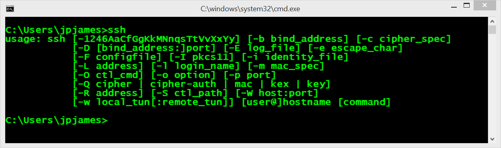
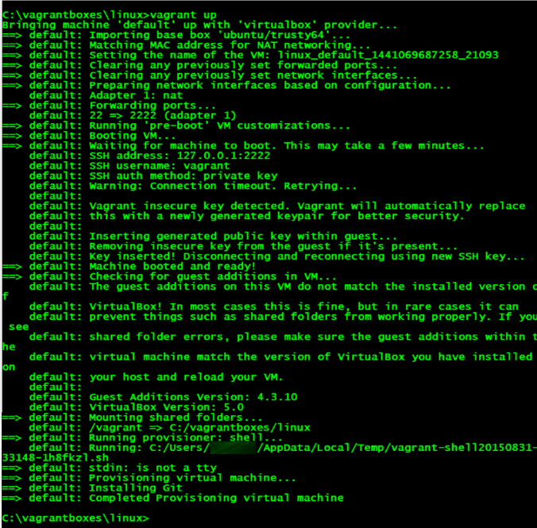
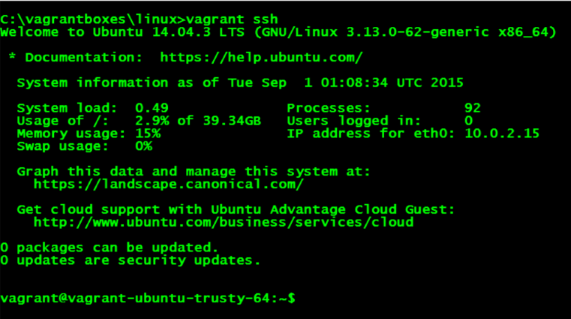
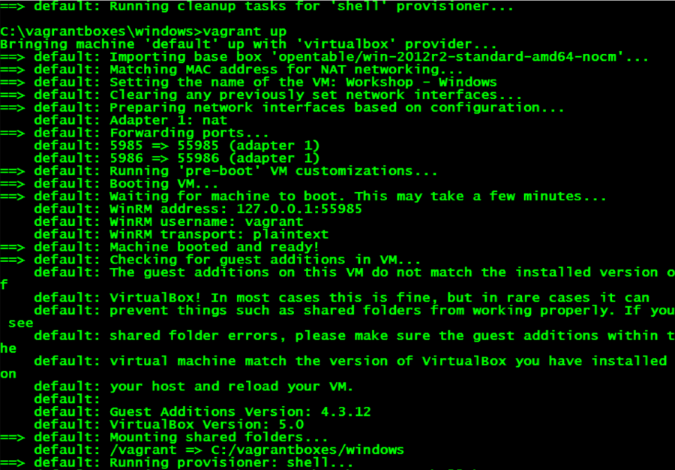

# Vagrant Hands-On Tutorial

This is the tutorial for the Vagrant workshop.  It will walk you through creating a Linux and Windows vagrant machine.

## Hardware Requirements

1. Minumum 4GB RAM, prefer at least 8GB.  It will be pretty slow with only 4GM of RAM.
1. Administrator rights on your machine
1. At least 25 GB of free hard drive space 

Note that the workshop will work on Windows, OSx, or Linux machine as long as you can run Virtualbox on the machine.

## Software Requirements

1. Virtualbox 5.x - [https://www.virtualbox.org/wiki/Downloads](https://www.virtualbox.org/wiki/Downloads)
1. Virtualbox Extension Pack - [http://download.virtualbox.org/virtualbox/5.0.2/Oracle_VM_VirtualBox_Extension_Pack-5.0.2-102096.vbox-extpack](http://download.virtualbox.org/virtualbox/5.0.2/Oracle_VM_VirtualBox_Extension_Pack-5.0.2-102096.vbox-extpack)
1. Vagrant - [https://www.vagrantup.com/downloads.html](https://www.vagrantup.com/downloads.html)
1. Git Command Line (Windows Only and Linux) - [https://github.com/git-for-windows/git/releases/download/v2.5.1.windows.1/Git-2.5.1-64-bit.exe](https://github.com/git-for-windows/git/releases/download/v2.5.1.windows.1/Git-2.5.1-64-bit.exe)

##Pre-Work

###Installing Virtualbox

1. Download Virtualbox and the Extension Pack from [https://www.virtualbox.org/wiki/Downloads](https://www.virtualbox.org/wiki/Downloads)
1. Run the Virtualbox installer and keep all of the defaults.
1. If you are asked to reboot your machine, go ahead and do that now. 
 
###Installing Vagrant

1. Download Vagrant from [https://www.vagrantup.com/downloads.html](https://www.vagrantup.com/downloads.html)
1. Run the installer and keep all of the defaults
1. If you are asked to reboot your machine, go ahead and do that now. 

###Installing Git (Windows Only)

1. Download Git from [https://github.com/git-for-windows/git/releases/download/v2.5.1.windows.1/Git-2.5.1-64-bit.exe](https://github.com/git-for-windows/git/releases/download/v2.5.1.windows.1/Git-2.5.1-64-bit.exe)
1. Run the exe installer after it downloads and keep all of the defaults 
1. After the install is completed, you need to add the Git bin path that contains the ssh client to the system path environment variable.  On my machine the sshe client was located at C:\Program Files\Git\usr\bin.  
1. After you add the Git ssh client path to the system path environment variable, open a command prompt and type ssh.  

##Adding Vagrant Boxes

Now we need to add our base boxes to the system.  For this tutorial we are going to create 2 machines:  1. Linux and 2. Windows.

For both machines we are going to use freely available vagrant boxes from the Vagrant cloud at [https://atlas.hashicorp.com/boxes/search](https://atlas.hashicorp.com/boxes/search).

### Add Linux Base Box

For the Linux machine we are going to use the ubuntu/trusty64 machine.  To download and add this machine to your available Vagrant boxes, run the following command:

		vagrant box add ubuntu/trusty64
		
This will take a few minutes to download the vagrant boxes.  

### Add Windows Base Box

For the Windows machine we are going to use the opentable/win-2012r2-standard-amd64-nocm machine.  To download and add this machine to your available Vagrant boxes, run the following command:

		vagrant box add opentable/win-2012r2-standard-amd64-nocm
		
This will take a few minutes to download the vagrant boxes.  
 
### Verify the Vagrant Boxes are Available 

To verify that the Vagrant boxes are available, run the following command:

	vagrant box list

 In the output you should see the 2 boxes that we just downloaded.
 
###Vagrant Configurations

We need to create a directory to hold all of our vagrant machine configurations.

1. Create the directory c:\vagrantboxes .

##Start of Workshop

Now you are ready to proceed with the actual workshop.

##Create Linux Machine

In this section we will create a Linux machine based on the ubuntu/trusty64 base box that you already added to vagrant.

1. Open a command prompt
1. Navigate to c:\vagrantboxes

	  	c:
	  	cd \vagrantboxes

1. Create directory named linux

		mkdir linux 
		
1. Navigate to the newly created linux directory

		cd linux 
 		
1. Initialize directory as a vagrant directory

		vagrant init ubuntu/trusty64

You are now ready to configure the vagrant machine.

### Configuring the Linux machine

The vagrant init command in the previous section created a file called vagrantfile in the linux directory.  The vagrantfile  contains all of the configurations for this vagrant machine. 

We need to edit this file to add all of the configurations for the virtual machine.  When you open this file you will notice that it is heavily documented with lots of useful examples.   If you want more detailed information you can view the full documentation at [http://docs.vagrantup.com/](http://docs.vagrantup.com/).

1. Open the vagrantfile in your favorite text editor. 

#### Virtualbox configuration 

We need to tell vagrant that we are going to use virtualbox for this machine.

Scroll down to the virtualbox section that is around line 46.  It will look like this

		# config.vm.provider "virtualbox" do |vb|
		#   # Display the VirtualBox GUI when booting the machine
		#   vb.gui = true
		#
		#   # Customize the amount of memory on the VM:
		#   vb.memory = "1024"
		# end
 
1. The # mean that the line is commented out.  
1.  You need to uncomment the starting line for the virtualbox section by removing the # character.
	
		config.vm.provider "virtualbox" do |vb|

1. Now we need to tell vagrant how much memory we want to configure for this machine. The memory configuration is done in megabytes, 1 gig equals 1024 megabytes.

		vb.memory = "1024"

1. Next we need to tell virtualbox how many cpus to use.  This should be set to the number of physical cpus that you  have.  In my case I have 2 physical cpus.

		vb.cpus = 2
		
1. We also want to give a friendly name to the Virtual machine Management UI just in case you ever need to use it.

     	vb.name = "Workshop - Linux"
	 		
1. Next we need to uncomment the "end" statement to tell vagrant where the virtualbox section ends.  
		
		end

At this point, your machine is ready to boot up.  However, Vagrant is only going to manage the Virtual machine and will not install any software onto the machine, so we are only half way to DevOps.
		
#### Provisioning

The next step is to automatically install our software and configurations into the vagrant machine.

We can do this by using the Vagrant Provisioners.  

For this lab we are going to run a shell script but there are several other provisioners available such as Puppet and Chef that I encourage to read about in the docs and give them a try. 

Now lets create out shell script we are going to run.  

1. In the c:\vagrantboxes\linux directory create a text file named main.sh
1. Open the main.sh file and add the following lines:

		echo "Provisioning virtual machine..."

		export DEBIAN_FRONTEND=noninteractive
		
		echo "Installing Git"
		apt-get install git -y > /dev/null
		
		
		echo "Completed Provisioning virtual machine"
		
1. Save the main.sh file

In the Vagrantfile we need to tell vagrant to run this script when it creates the machine.

After the Virtualbox section, add the following line:

		config.vm.provision :shell, path: "main.sh"
		

### Starting up the Linux box

Now that you have the Linux machine configured it is time to boot it up. 

In the command prompt that still have opened to the c:\vagrantboxes\linux directory, run the following command:

	vagrant up
	
You will  see a bunch of messages in the command prompt such as this screenshot:

Now the machine is created, booted up in headless mode (no GUI), had git installed and it ready to be logged into to through ssh.

### Logging into the Linux Machine

Now lets log into the vagrant machine that we just created. 

In the command prompt that you still have open to the linux directory, run the following command:

		vagrant ssh 
		

		
You are now logged into the vagrant Linux machine and can interact with it.  

To exit from the ssh session type exit and pressed enter.
  
### Vagrant Commands

There are several other commands that you will want to know.  Below is a list of those commands.

* Reboot: vagrant reload
* Hibernate: vagrant suspend 
 * Status: vagrant status
 * Global status: vagrant global-status
 * Shutdown: vagrant halt
 * Delete machine but keep Vagrantfile: vagrant destroy
  
## Congratulations 

Congratulations you have completed the linux portion of this workshop.  

Go ahead and shutdown the Linux machine and move onto to the Windows portion of this workshop.

## Windows Vagrant Machine

This section will walk you through creating a Windows vagrant box based on the opentable/win-2012r2-standard-amd64-nocm base box.

1. Open a command prompt
1. Navigate to c:\vagrantboxes

	  	c:
	  	cd \vagrantboxes

1. Create directory named windows

		mkdir windows 
		
1. Navigate to the newly created windows directory

		cd windows 
 		
1. Initialize directory as a vagrant directory

		vagrant init opentable/win-2012r2-standard-amd64-nocm
		
### Configuring the windows machine

The vagrant init command in the previous section created a file called vagrantfile in the windows directory.  The vagrantfile contains all of the configurations for this vagrant machine. 

We need to edit this file to add all of the configurations for the virtual machine.  When you open this file you will notice that it is heavily documented with lots of useful examples.   If you want more detailed information you can view the full documentation at [http://docs.vagrantup.com/](http://docs.vagrantup.com/).

1. Open the vagrantfile in your favorite text editor. 

####General Vagrant configurations

After the line 
	config.vm.box = "opentable/win-2012r2-standard-amd64-nocm"
	
Add the following 2 lines:
 
	config.vm.boot_timeout = 600
	config.vm.communicator = "winrm"

With Windows machine it takes longer for them to boot the first time and we don't want Vagrant to time out.  

As well the default communication method for vagrant to the virtual machine is ssh.  For Windows we need to tell vagrant to use Windows Remote Management (WinRM).	
	
#### Virtualbox configuration 

We need to tell vagrant that we are going to use virtualbox for this machine.

Scroll down to the virtualbox section that is around line 48.  It will look like this

		# config.vm.provider "virtualbox" do |vb|
		#   # Display the VirtualBox GUI when booting the machine
		#   vb.gui = true
		#
		#   # Customize the amount of memory on the VM:
		#   vb.memory = "1024"
		# end
 
1. The # mean that the line is commented out.  
1.  You need to uncomment the starting line for the virtualbox section by removing the # character.
	
		config.vm.provider "virtualbox" do |vb|

1. Unlike the Linux machine, we are going to use the Virtualbox GUI to interact with the Windows virtual machine.

		vb.gui = true
		
1. Now we need to tell vagrant how much memory we want to configure for this machine. The memory configuration is done in megabytes, 1 gig equals 1024 megabytes.  I typically set this to half of the memory that my physical machine has so that I can get the best performance from the virtual machine.

		vb.memory = "4096"

1. Next we need to tell virtualbox how many cpus to use.  This should be set to the number of physical cpus that you  have.  In my case I have 2 physical cpus.

		vb.cpus = 2

1. We also want to give a friendly name to the Virtual machine Management UI just in case you ever need to use it.

     	vb.name = "Workshop - Windows"

1. Since we are using the Virtualbox GUI for this machine, we want to make sure that we can copy, cut, and paste between the host machine and the virtual machine.  Note that :id in the command tell vagrant to replace this with the actual reference to the virtualbox machine.

	vb.customize ["modifyvm", :id, "--clipboard", "bidirectional"]
	
1. Next we need to uncomment the "end" statement to tell vagrant where the virtualbox section ends.  
		end

At this point, your machine is ready to boot up.  However, Vagrant is only going to manage the Virtual machine and will not install any software onto the machine, so we are only half way to DevOps.
		
#### Provisioning

The next step is to automatically install our software and configurations into the vagrant machine.

We can do this by using the Vagrant Provisioners.  

For this lab we are going to run a shell script but there are several other provisioners available such as Puppet and Chef that I encourage to read about in the docs and give them a try. 

Now lets create out shell script we are going to run.  

1. In the c:\vagrantboxes\windows directory create a text file named main.cmd
1. Open the main.cmd file and add the following lines:

		@powershell -NoProfile -ExecutionPolicy Bypass -File "%systemdrive%\vagrant\InstallChocolatey.ps1"
		
1. Save the main.cmd file

In the Vagrantfile we need to tell vagrant to run this script when it creates the machine.

After the Virtualbox section, add the following line:

		config.vm.provision :shell, path: "main.cmd"
		
1. In the c:\vagrantboxes\windows directory create a text file named InstallChocolatey.ps1
1. Open the InstallChocolatey.ps1 file and add the following lines:

		$ChocoInstallPath = "$env:SystemDrive\ProgramData\Chocolatey\bin"
		
		if (!(Test-Path $ChocoInstallPath)) {
			iex ((new-object net.webclient).DownloadString('https://chocolatey.org/install.ps1'))
		}
		
1. Save the InstallChocolatey.ps1 file
 

### Starting up the Windows box

Now that you have the Windows machine configured it is time to boot it up. 

In the command prompt that still have opened to the c:\vagrantboxes\windows directory, run the following command:

	vagrant up
	
You will  see a bunch of messages in the command prompt such as this screenshot:

Now the machine is created, booted up, had chocolatey installed and you can interact with it using the Virtualbox GUI.  

Note that if we had forwarded the RDP port, we could use the vagrant rdp command to login to the machine and run it without the Virtualbox GUI.

## Packaging A Machine

If you get a machine just like you want it and want to share it the easiest thing to do is run the Vagrant package command.

[https://docs.vagrantup.com/v2/cli/package.html](https://docs.vagrantup.com/v2/cli/package.html)

###Workshop Linux Box Packaging

To package the linux machine, open a command prompt and navigate to c:\vagrantboxes\linux and run the following command:

	vagrant package --output "Workshop-Linux.box" 
 		 
This command creates a file called Workshop-Linux.box that you can now use as a base box and add into vagrant with the vagrant box add command.

###Workshop Windows Box Packaging

To package the windows machine, open a command prompt and navigate to c:\vagrantboxes\windows and run the following command:

	vagrant package --output "Workshop-Windows.box" 
 		 
This command creates a file called Workshop-Windows.box that you can now use as a base box and add into vagrant with the vagrant box add command.

##Behind a Firewall?

If you are behind a firewall, you need to do a little bit of additional configuration to get all of the proxy settings configured.  I have an article on my blog that has the isntructiosn at [http://digitaldrummerj.me/vagrant-behind-proxy-server/](http://digitaldrummerj.me/vagrant-behind-proxy-server/)

Note:  Don't use the vagrant-proxyconf vagrant plugin with Vagrant 1.7.4.  This plugin now errors trying to set the proxy.  Instead create a shell script to call the SETX command line and run it as a shell script provision. 